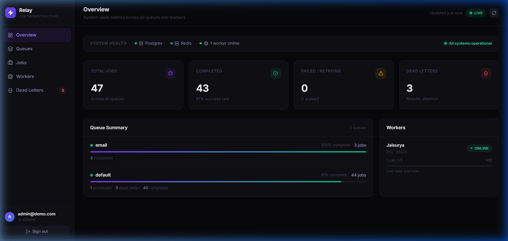
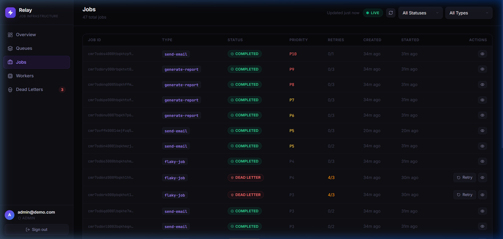
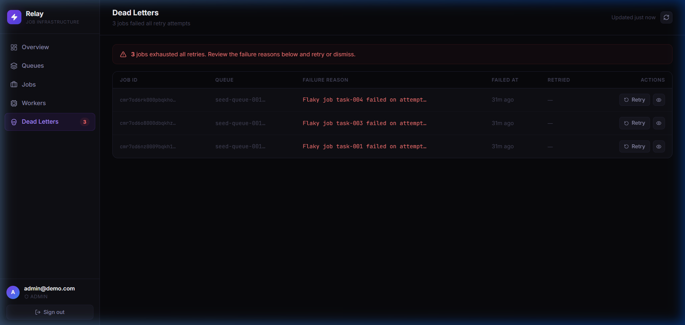
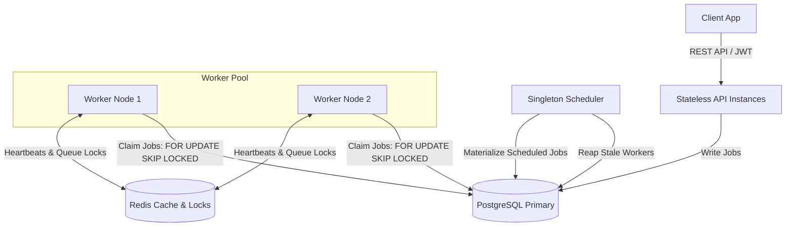

# Relay — Distributed Background Job Infrastructure

Relay is a distributed background job scheduling platform. It uses transactional row-level locking via PostgreSQL `SKIP LOCKED` and distributed synchronization via Redis to ensure disjoint, non-blocking parallel execution across worker pools, with automatic failover, re-queuing, and isolated dead-letter queue (DLQ) tracking.

---

## Management Console

### 1. Queues Fleet & Metrics Dashboard


### 2. Job Explorer & Real-Time Lifecycle tracing


### 3. Dead-Letter Queue (DLQ) Inspector & Manual Retries


---

## Architecture



---

## Quick Start

```bash
docker compose up -d
npm install
npx prisma migrate dev --name init
npx prisma db seed
npm run dev:api
npm run dev:worker
npm run dev:scheduler
# To run UI Console:
cd dashboard && npm install && npm run dev
```

---

## Key Engineering Decisions

- **Atomic Claiming:** Uses PostgreSQL `SELECT FOR UPDATE SKIP LOCKED` inside a transaction to prevent race conditions and ensure disjoint job processing across workers.
- **Idempotency Keys:** Enforces client-side idempotency using unique constraints on `(idempotencyKey, organizationId)` to prevent duplicate job creation on retry.
- **Exponential Backoff with Jitter:** Implements exponential retry delays with a range of +/-20% randomized jitter to avoid thundering herd contention on downstream resources.
- **Immutable DLQ Snapshots:** Creates independent copies of the payload in the `DeadLetterQueue` table so debugging forensics survive even if original jobs are purged.
- **Graceful Recovery:** Integrates standard worker heartbeats with a scheduler-driven reaper that automatically releases claimed jobs of crashed worker nodes back to `QUEUED`.

---

## Documentation Reference

Full technical specifications, schema listings, and diagrams are available in the [docs/](docs) directory.
