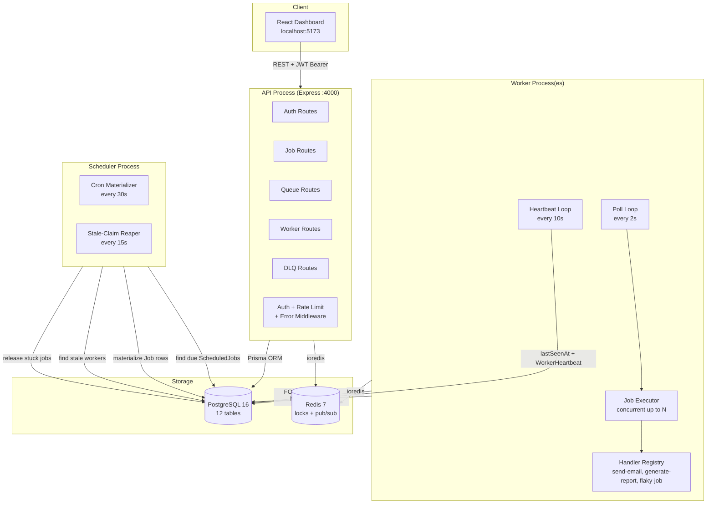
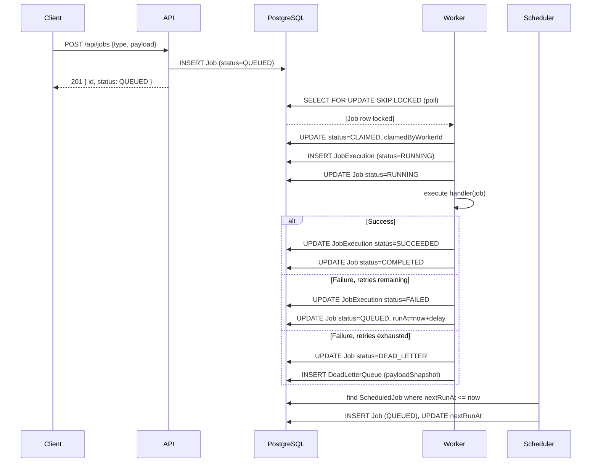
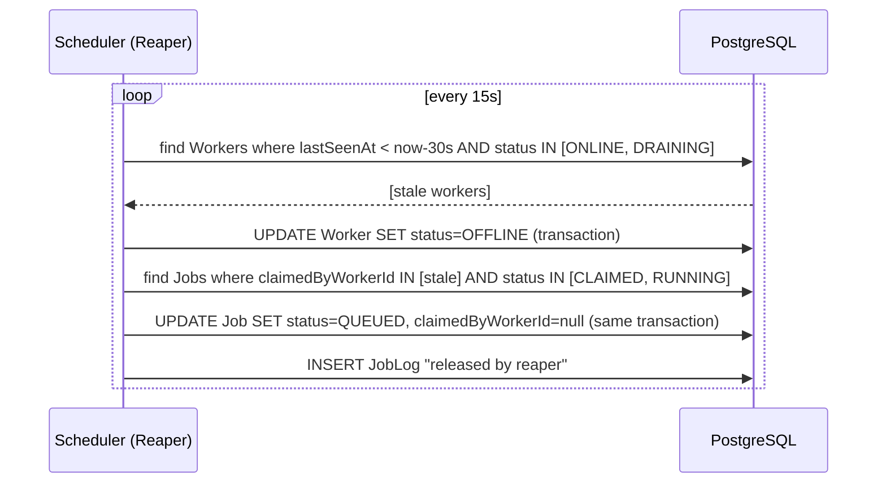

# Architecture

## System Diagram

---

## Process Separation Rationale

### Why three separate processes?

**Independent scaling.** Workers are the compute-intensive component — each additional worker process adds linear throughput because the `FOR UPDATE SKIP LOCKED` claim query is safe under concurrent contention. You can run ten worker instances with no coordination overhead beyond what Postgres provides. The API process is stateless and can sit behind a load balancer. The scheduler is a singleton for simplicity (running two would double-materialize cron jobs without a leader election mechanism — see Design Decisions for the cut scope note).

**Failure isolation.** A crashing worker doesn't affect the API or the scheduler. In-flight jobs are recovered by the reaper within 30 seconds. A crashing scheduler doesn't lose in-flight executions because the scheduler only *creates* Job rows — it never runs handlers. The API can continue serving read and create requests even if both other processes are down.

**Operational clarity.** Each process has a single responsibility and a clear shutdown contract:
- The API drains HTTP connections on SIGTERM.
- The worker marks itself DRAINING, waits for in-flight jobs, then goes OFFLINE.
- The scheduler just stops its intervals — no in-flight state to drain.

---

## Data Flow: Job Lifecycle

---

## Reaper Flow

---

## Horizontal Scaling Notes

| Component | How to scale |
|---|---|
| Worker | Run N worker processes. The claim query's `SKIP LOCKED` means no coordination is needed — each worker claims its own slice. |
| API | Stateless — put behind any load balancer (nginx, ALB). Each instance reads from the same Postgres. |
| Scheduler | Run as a singleton. Two schedulers would double-materialize cron jobs. A production-grade solution would use a Postgres advisory lock or Redis leader election. |
| Postgres | At current scale: one primary is sufficient. At 10x job volume: add read replicas for the API's SELECT-heavy queries; the write path (claim, heartbeat, execution update) stays on the primary. At 100x: consider partitioning the Job table by queueId. |
| Redis | Used only for distributed locks (SET NX PX). At current scale one Redis instance is sufficient. Sentinel or Cluster for HA if needed. |
