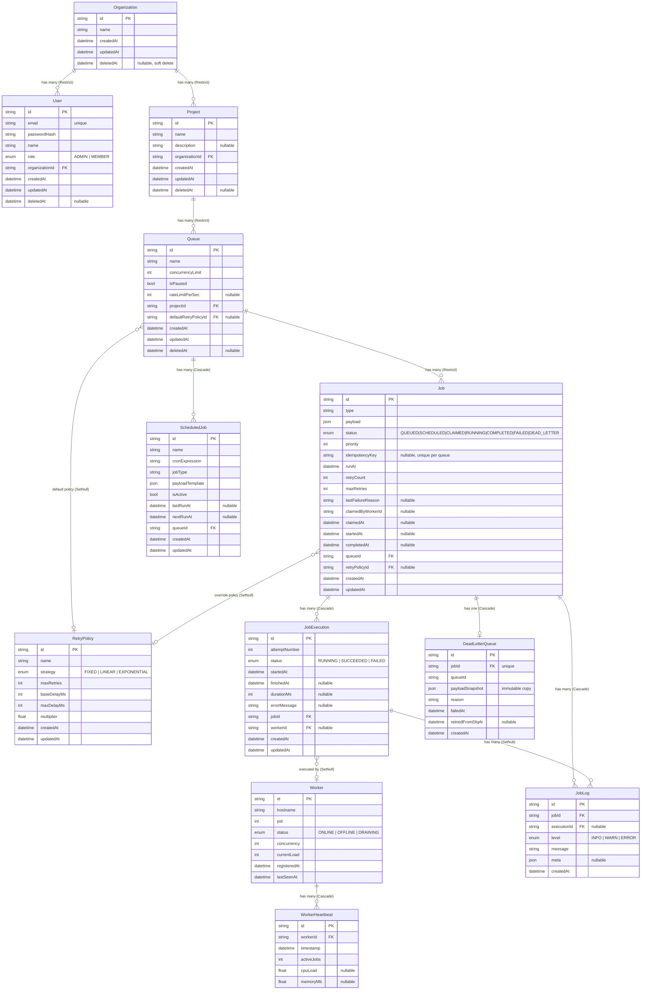

# ER Diagram

---

## Key Index Justifications

| Index | Table | Purpose |
|---|---|---|
| `(queueId, status, runAt)` | Job | Claim query filter: `WHERE queueId = $1 AND status = 'QUEUED' AND runAt <= now()` — composite index covers all three predicates in one scan |
| `(queueId, idempotencyKey)` | Job | Unique constraint for duplicate-safe submissions — O(1) lookup |
| `(workerId, timestamp)` | WorkerHeartbeat | Reaper and dashboard queries filtering by worker over time |
| `(jobId, createdAt)` | JobLog | Fetch recent logs for a job, ordered chronologically |
| `(isActive, nextRunAt)` | ScheduledJob | Scheduler polls this exact filter every 30s |
| `queueId` | DeadLetterQueue | DLQ listing filtered by queue |

## Cascade Rules Summary

| Relationship | Rule | Reason |
|---|---|---|
| Job → JobExecution | Cascade | Execution records are meaningless without their job |
| Job → JobLog | Cascade | Log lines are meaningless without their job |
| Job → DeadLetterQueue | Cascade | DLQ record is meaningless without its job |
| Worker → WorkerHeartbeat | Cascade | Heartbeat log is meaningless without the worker |
| Queue → ScheduledJob | Cascade | Cron templates exist in the context of their queue |
| Org → User | Restrict | Cannot silently delete an org with active users |
| Org → Project | Restrict | Cannot silently delete an org with active projects |
| Project → Queue | Restrict | Cannot silently delete a project with active queues |
| Queue → Job | Restrict | Cannot silently delete a queue with jobs in it |
